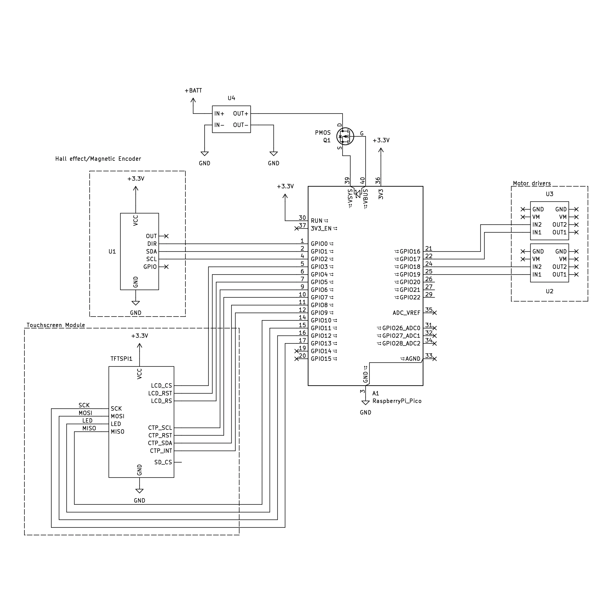

# robotics traveling van inverted pendulum robot

everything needed to power an inverted pendulum robot (ipr) with four motors, including the code, parts lists, CAD model, and instructions. when you're done, check out our [ball and beam balance robot](https://github.com/jtof-dev/robotics-traveling-van-bbb) and our [website](https://sce.nau.edu/capstone/projects/EE/2026/RoboVan/)

```ascii flowchart
                                ┌─────────┐
                                │         │
                                │ initial │
                                │  boot   │
                                │         │
                                └────┬────┘
                                     │
          ┌───────────────────┐      │      ┌─────────────┐
          │                   │      │      │             │
          │ send brake signal │◄─────┼─────►│ set up pins │
          │     to motors     │      │      │             │
          │                   │      │      └─────────────┘
          └───────────────────┘      │
                                     ▼
                                ┌────────┐
                                │        │
                                │ main() │
                                │        │
                                └────┬───┘
                                     │
                                     │
                                     │
                                     ▼
   ┌─────────────────┐      ┌──────────────────┐      ┌────────────────┐
   │                 │      │                  │      │                │
   │ send speed PWM  ├─────►│ write a frame to ├─────►│ read magnetic  │
   │ value to motors │      │ the touchscreen  │      │ encoder values │
   │                 │      │                  │      │                │
   └─────────────────┘      └──────────────────┘      └─────────────┬──┘
      ▲                                                             │
      │                                                             │
      │                                                             │
      │                                                             │
      │                                                             │
      │     ┌─────────────────────┐      ┌─────────────────────┐    │
      │     │                     │      │                     │    │
      └─────┤ adjust output value │◄─────┤ run PID calculation │◄───┘
            │                     │      │                     │
            └─────────────────────┘      └─────────────────────┘
```

# notes

## directory structure

- **datasheets/**: datasheets for the specific parts used in this robot
- **lib/**: contains all submodules
- **scripts/**: all scripts commonly used while writing code
- **sims/**: any python scripts used to model the behavior of the inverted pendulum
- **src/**: our own written code, split into a `configuration.hpp` and `main.cpp`, along with some extra functions split off into individual files

# software

## building

- first, fetch all submodules with `git submodule update --init --recursive` or delete and re-clone all submodules with `scripts/submoduleSetup.sh`

then build with CMAKE (or with `scripts/buildFresh.sh`):

```bash
    mdkir build
    cd build
    cmake ..
    make
```

(note: updating configurations in `src/configuration.hpp` does not trigger a proper re-build, so only running `make` will often not be enough)

## uploading

- to flash the compiled `.uf2`, either reboot the pico into BOOTSEL mode (hold the BOOTSEL button and plug in the pico), or use `picotool` (or `scripts/upload.sh`):

```bash
picotool load -f -x flash.uf2
```

## submodules

- [dancesWithMachines/dwm_pico_as45600](https://github.com/dancesWithMachines/dwm_pico_as5600)
- [raspberrypi/pico-sdk](https://github.com/raspberrypi/pico-sdk)
- [jtof-dev/pico-pid-library](https://github.com/jtof-dev/pico-pid-library)

## sims

- located in `sims/`, and models the expected behavior of the robot. theoretically, it should produce similar gain values to what will be used on the physical robot
- the python environment is managed with `uv`:

```bash
uv sync
uv run main.py
```

or, install `matplotlib` and run normally

# hardware



## parts list

- [AS5600](./datasheets/AS5600_datasheet.pdf) magnetic encoder
- [DRV8871](./datasheets/DRV8871_datasheet.pdf) motor driver
- [GM3865-520](https://web.archive.org/web/20260407004016/https://www.amazon.com/dp/B0F1N9VZSK) dc motor
- raspberry pi pico or [RP2040](./datasheets/RP2040_datasheet.pdf) compatible board
- touchscreen with [ST7796S](./datasheets/ST7796S_datasheet.pdf) display driver

### generic parts

- 4-pack of 3.3V batteries (in series for 13V total), matching BMS, and charger
  - be sure to match max voltage, current, and battery chemistry type between all three components
- step-down voltage converter to 3.3V
- 470uF 25V electrolytic capacitor

## pin configuration

### AS5600 magnetic encoder

| **pin** | **connection**              | **color** |
| ------- | --------------------------- | --------- |
| VCC     | 3.3v on pico                | red       |
| OUT     | --                          | --        |
| GND     | GND on pico                 | black     |
| DIR     | HIGH or LOW (currently low) | black     |
| SCL     | 5 on pico                   | blue      |
| SDA     | 4 on pico                   | white     |
| GPO     | --                          | --        |

### DRV8871 motor driver

| **pin** | **connection**                |
| ------- | ----------------------------- |
| motor+  | 12v+ to motor                 |
| motor-  | 12v- to motor                 |
| power+  | 12v+ from PSU                 |
| power-  | 12v- from PSU                 |
| IN1     | 6 on pico                     |
| IN2     | 7 on pico                     |
| VM      | passthrough 12v (don't use!!) |
| GND     | passthrough ground            |

| **IN1** | **IN2** | **OUT1** | **OUT2** | **description** |
| :-----: | :-----: | :------: | :------: | :-------------- |
|    0    |    0    |  high-z  |  high-z  | coast           |
|    0    |    1    |    L     |    H     | reverse         |
|    1    |    0    |    H     |    L     | forward         |
|    1    |    1    |    L     |    L     | brake           |

### GM3865-520 DC motor

| **pin** | **connection**         | **wire color** |
| :------ | :--------------------- | :------------- |
| M+      | 12v+ from motor driver | white          |
| M-      | 12v- from motor driver | blue           |
| GND     | 3.3v GND from pico     | green          |
| VCC     | 3.3v from pico         | yellow         |
| A       | 2 on pico              | red            |
| B       | 3 on pico              | black          |

# contributors

### [andy babcock](https://github.com/jtof-dev)

- developed the electronics and balancing software for the inverted pendulum robot

### [kaden zaremba](https://github.com/kadenisuhhh)

- developed the touchscreen software

### [david jimenez](https://www.linkedin.com/in/davidkjimenez)

- assisted with the electronics design and assembly

### [kyle draper](https://github.com/Kdra-bit)

- assisted with the electronics design and bug-fixing

### [andres gonzales](https://github.com/AndresGonzales-hub)

- developed the CAD model and helped with assembly

### [colin parsinia](https://www.linkedin.com/in/colin-parsinia-9b55a7176/)

- developed the CAD model and helped with assembly
